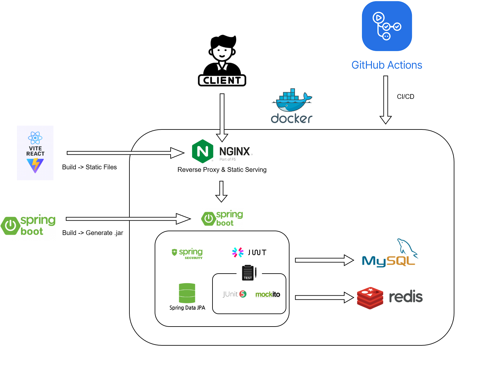

# 🚀 MoimMoim (모임모임)

> **"누구나 쉽게 만들고 참여하는 커뮤니티 모임 플랫폼"**

**MoimMoim**은 백엔드 엔지니어로서 기술적 근거를 바탕으로 최적화된 모임 관리 서비스를 제공합니다. 복잡한 참여 프로세스를 단순화하고, **SSE를 통한 실시간 알림**으로 서비스의 생동감을 높였습니다.

🔗 **배포 URL**: [moimmoim.co.kr](https://moimmoim.co.kr) <br>
📄 **상세 문서(설계 결정, 트러블슈팅 분석)**: [docs/analysis.md](./docs/analysis.md) · [ADR 모음](./docs/adr)

---

## 🏗️ Architecture



- 클라이언트 요청은 Nginx가 받아 정적 파일은 직접 서빙하고, `/api/**` 요청은 Spring Boot로 프록시합니다.
- GitHub Actions가 빌드(React 정적 파일, Spring Boot jar)부터 배포까지 CI/CD를 담당합니다.
- Spring Boot는 MySQL(영속 데이터)과 Redis(캐시)에 연결됩니다.

---

## 🛠️ Tech Stack

### **Backend**
- **Framework**: Java 17, Spring Boot 3.4.x
- **Database**: MySQL 8.0, Redis (Ranking & Cache)
- **ORM**: Spring Data JPA
- **Security**: Spring Security, **JWT** (Stateless 인증)
- **Communication**: **SSE (Server-Sent Events)**
- **Infra**: Docker Compose, Nginx, Let's Encrypt, GitHub Actions CI/CD

### **Frontend**
- **Library**: React, Vite
- **Communication**: Axios, EventSource

---

## 📂 Project Structure

역할에 따른 계층 분리를 통해 유지보수성과 확장성을 고려하여 설계되었습니다.

```
com.example.backend/
├── common/             # 글로벌 공통 모듈
│   ├── config/         # App, Swagger, Redis 등 각종 설정
│   ├── exception/      # 전역 예외 처리 (GlobalExceptionHandler)
│   └── security/       # JWT Provider 및 시큐리티 필터
├── controller/         # API 엔드포인트 레이어
├── dto/                # 요청/응답 데이터 전송 객체
├── entity/             # JPA 엔티티 도메인 모델
│   ├── Member, MeetingPost, Participation
│   └── Notification, Category, Region, BaseTimeEntity
├── enums/              # 상태 및 타입 관리를 위한 Enum 모음
├── repository/         # DB 접근을 위한 Spring Data JPA 인터페이스
└── service/            # 핵심 비즈니스 로직 및 외부 연동 (SSE 등)
```

---

## 📌 핵심 MVP 기능 (Current Status)

### 1. 실시간 알림 시스템 (SSE)
- 사용자의 참여 신청 및 방장의 승인/거절 상태를 **SSE(Server-Sent Events)**를 통해 실시간으로 전달합니다.
- 커스텀 이벤트(`newNotification`)를 정의하여 데이터 전송의 명확성을 확보했습니다.

### 2. 참여 신청 및 승인 프로세스
- 방장(작성자)은 모임 생성 시 자동으로 참여자로 등록되며, 일반 유저의 신청에 대한 승인/거절 권한을 가집니다.
- 정원이 정해진 모임에서 동시 신청이 몰려도 정원을 초과하지 않도록 **동시성 제어**를 적용했습니다. (아래 Trouble Shooting 참고)

### 3. JWT 기반 인증 시스템
- `JwtAuthenticationFilter`를 통해 무상태(Stateless) 기반의 보안을 구축했습니다.
- 회원가입, 로그인, 로그아웃 전반의 인증 프로세스를 처리합니다.

---

## 💡 Trouble Shooting

문제 발견 → 원인 분석 → 조치 → 수치로 검증, 순서로 정리했습니다. 상세 분석은 [docs/analysis.md](./docs/analysis.md)에 있습니다.

### 1. N+1 쿼리 문제 해결
- **문제**: Hibernate Statistics로 확인한 결과, 모임 목록 조회 시 연관 엔티티마다 쿼리가 추가로 발생하며 총 **42회**의 쿼리가 나가는 것을 확인
- **조치**: fetch join을 적용해 연관 데이터를 한 번의 쿼리로 조회하도록 변경
- **결과**: 쿼리 횟수 **42회 → 1회**로 감소

### 2. 동시성 제어 (선착순 참가 정원 초과 방지)
- **문제**: 정원이 있는 모임에 다수 유저가 동시에 참여 신청할 경우, 정원을 초과해서 승인될 수 있는 레이스 컨디션 가능성 발견
- **조치**: `MeetingPost → Participation`에 `PESSIMISTIC_WRITE` 락을 적용하고, 데드락 방지를 위해 락 획득 순서를 고정
- **검증**: `ExecutorService` + `CountDownLatch`로 정원 5명인 모임에 10개 스레드가 동시 요청하는 테스트를 작성해 검증. 이 과정에서 버그 4건을 추가로 발견해 수정
- **결과**: 테스트 케이스 **72개 → 78개**로 증가, 동시 요청 상황에서도 정원 초과 없이 정상 동작 확인

### 3. SSE 이벤트 리스너 미작동
- 기본 `message` 이벤트가 아닌 커스텀 네이밍을 사용할 때, 송수신 측의 이벤트 이름 불일치 문제를 해결하여 실시간 통신을 성공시켰습니다.

### 4. 참여 목록 데이터 중복
- JPQL에 작성자 제외 조건을 추가하여 비즈니스 로직과 UI 출력 간의 괴리를 해결했습니다.

---

## 📐 설계 결정 (ADR)

주요 기술적 의사결정과 그 이유, 검토했던 대안을 ADR로 기록하고 있습니다.

- [ADR-001 ~ ADR-005](./docs/adr) — 코드와 대조해 검증 완료

---

## 📅 Roadmap (Next Steps)

- [x] N+1 쿼리 문제 해결 (fetch join)
- [x] 동시성 제어 (PESSIMISTIC_WRITE 락 + 데드락 방지)
- [ ] **Redis**: 조회수 기반 실시간 인기 모임 랭킹 시스템
- [ ] **viewCount**: 조회수 캐싱 전략 도입
- [ ] **k6 부하 테스트**: 캐싱 전후 성능 비교
- [ ] **Querydsl**: 카테고리/지역별 복합 필터링 및 동적 검색 도입
- [ ] **AWS S3**: 모임 썸네일 및 프로필 이미지 업로드 연동